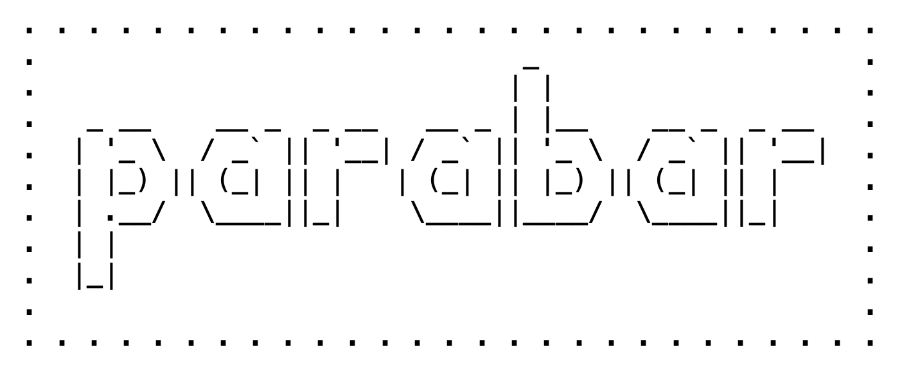
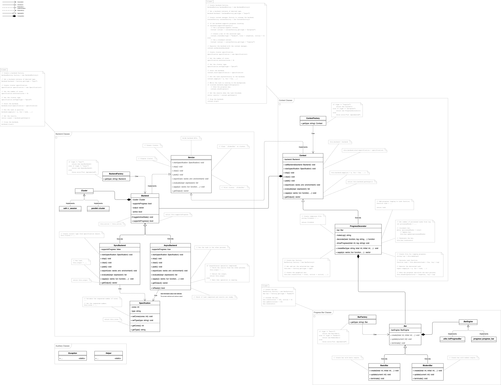

<p align="center">
    <a href="https://parabar.mihaiconstantin.com">
        
    </a>
</p>

<h1 align="center">
    Progress Bar for Parallel Tasks
    <br>
    <sub>...and more</sub>
</h1>

<!-- badges: start -->
<p align="center">
    <a href="https://www.repostatus.org/#active"></a>
    <a href="https://github.com/mihaiconstantin/parabar/releases"></a>
    <a href="https://github.com/mihaiconstantin/parabar"></a>
    <a href="https://github.com/mihaiconstantin/parabar"></a>
    <a href="https://github.com/mihaiconstantin/parabar/actions"></a>
</p>
<!-- badges: end -->

A [`parabar`](https://parabar.mihaiconstantin.com) is a package designed to
provide a simple interface for executing tasks in parallel, while also providing
functionality for tracking and displaying the progress of the tasks.

This package is aimed at two audiences: (1) end-users who want to execute a task
in parallel in an interactive `R` session and track the execution progress, and
(2) `R` package developers who want to use
[`parabar`](https://parabar.mihaiconstantin.com) as a solution for parallel
processing in their packages.

## Installation
We are planning to submit parabar soon to `CRAN`. In the meantime, you can
install the latest development version from GitHub using the following command:

```r
# Install the package.
remotes::install_github("mihaiconstantin/parabar")

# Load the package.
library(parabar)
```

## Usage
Below you can find a few examples of how to use
[`parabar`](https://parabar.mihaiconstantin.com) in your `R` scripts, both for
end-users, and for developers. All examples below assume that you have already
installed and loaded the package.

### Users
In general, the usage of [`parabar`](https://parabar.mihaiconstantin.com)
consists of the following steps:

1. Start a backend for parallel processing.
2. Execute a task in parallel.
3. Stop the backend.

Optionally, you can also configure the progress bar if the backend created
supports progress tracking, or perform additional operations on the backend.

#### Synchronous Backend
The simplest, and perhaps least interesting, way to use
[`parabar`](https://parabar.mihaiconstantin.com) is by requesting a synchronous
backend.

```r
# Start a synchronous backend.
backend <- start_backend(cores = 4, cluster_type = "psock", backend_type = "sync")

# Run a task in parallel.
results <- par_sapply(backend, 1:1000, function(x) {
    # Sleep a bit.
    Sys.sleep(0.01)

    # Compute and return.
    x + 1
})
```

At this point you will notice the following warning message:

```txt
Warning message:
Progress tracking not supported for backend of type 'SyncBackend'.
```

The reason for this is because progress tracking only works for asynchronous
backends, and [`parabar`](https://parabar.mihaiconstantin.com) enables progress
tracking by default at load time. We can disable this by option to get rid of
the warning message.

```r
# Disable progress tracking.
set_option("progress_track", FALSE)
```

We can verify that the warning message is gone by running the task again,
reusing the backend we created earlier.

```r
# Run a task in parallel.
results <- par_sapply(backend, 1:1000, function(x) {
    # Sleep a bit.
    Sys.sleep(0.01)

    # Compute and return.
    x + 1
})
```

When we are done with this backend, we can stop it to free up the resources.

```r
# Stop the backend.
stop_backend(backend)
```

#### Asynchronous Backend
The more interesting way to use [`parabar`](https://parabar.mihaiconstantin.com)
is by requesting an asynchronous backend. This is the default backend type, and
highlights the strengths of the package.

First, let's ensure progress tracking is enabled (i.e., we disabled it above).

```r
# Enable progress tracking.
set_option("progress_track", TRUE)
```

Now, we can proceed with creating the backend and running the task.

```r
# Start an asynchronous backend.
backend <- start_backend(cores = 4, cluster_type = "psock", backend_type = "async")

# Run a task in parallel.
results <- par_sapply(backend, 1:1000, function(x) {
    # Sleep a bit.
    Sys.sleep(0.01)

    # Compute and return.
    x + 1
})
```

At this point, we can see that the progress bar is displayed, and that the
progress is tracked. The progress bar is updated in real-time, after each task
execution, e.g.:

```txt
 > completed 928 out of 1000 tasks [ 93%] [ 3s]
```

We can also configure the progress bar. For example, suppose we want to display
an actual progress bar.

```r
# Change the progress bar options.
configure_bar(type = "modern", format = "[:bar] :percent")

# Run a task in parallel.
results <- par_sapply(backend, 1:1000, function(x) {
    # Sleep a bit.
    Sys.sleep(0.01)

    # Compute and return.
    x + 1
})
```

The progress bar will now look like this:

```txt
[====================>-------------------------------------------------]  30%
```

By default, [`parabar`](https://parabar.mihaiconstantin.com) uses the
[`progress`](https://cran.r-project.org/package=progress) package to display the
progress bar. However, we can easily swap it with another progress bar engine.
For example, suppose we want to use the built-in
[`utils::txtProgressBar`](https://stat.ethz.ch/R-manual/R-devel/library/utils/html/txtProgressBar.html).

```r
# Change to and adjust the style of the `basic` progress bar.
configure_bar(type = "basic", style = 3)

# Run a task in parallel.
results <- par_sapply(backend, 1:1000, function(x) {
    # Sleep a bit.
    Sys.sleep(0.01)

    # Compute and return.
    x + 1
})
```

Check out `?configure_bar` for more information on the possible ways of
configuring the progress bar.

We can also disable the progress bar for asynchronous backends altogether, by
adjusting the package options.

```r
# Disable progress tracking.
set_option("progress_track", FALSE)

# Run a task in parallel.
results <- par_sapply(backend, 1:1000, function(x) {
    # Sleep a bit.
    Sys.sleep(0.01)

    # Compute and return.
    x + 1
})
```

We can stop the backend when we are done.

```r
# Stop the backend.
stop_backend(backend)
```

#### No Backend
Finally, we can also the `?par_sapply` function without a backend, which will
resort to running the task sequentially by means of
[`utils::sapply`](https://stat.ethz.ch/R-manual/R-devel/library/base/html/lapply.html).


```r
# Run the task sequentially using the `base::sapply`.
results <- par_sapply(backend = NULL, 1:300, function(x) {
    # Sleep a bit.
    Sys.sleep(0.01)

    # Compute and return.
    x + 1
})
```

#### Additional Operations
As indicated above, the general workflow consists of starting a backend,
executing a task in parallel, and stopping the backend. However, there are
additional operations that can be performed on a backend (i.e., see
_**Developers**_ section). The table below lists all available operations that
can be performed on a backend.

| Operation                                                                                                                    | Description                                   |
| :--------------------------------------------------------------------------------------------------------------------------- | :-------------------------------------------- |
| <code><a href="https://parabar.mihaiconstantin.com/reference/start_backend.html">start_backend(backend)</a></code>           | Start a backend.                              |
| <code><a href="https://parabar.mihaiconstantin.com/reference/stop_backend.html">stop_backend(backend)</a></code>             | Stop a backend.                               |
| <code><a href="https://parabar.mihaiconstantin.com/reference/clear.html">clear(backend)</a></code>                           | Remove all objects from a backend.          |
| <code><a href="https://parabar.mihaiconstantin.com/reference/peek.html">peek(backend)</a></code>                             | List the names of the variables on a backend. |
| <code><a href="https://parabar.mihaiconstantin.com/reference/export.html">export(backend, variables, environment)</a></code> | Export objects to a backend.                  |
| <code><a href="https://parabar.mihaiconstantin.com/reference/evaluate.html">evaluate(backend, expression)</a></code>         | Evaluate expressions on a backend.            |
| <code><a href="https://parabar.mihaiconstantin.com/reference/par_sapply.html">par_sapply(backend, x, fun)</a></code>         | Run tasks in parallel on a backend.           |

Check the documentation corresponding to each operation for more information and
examples.

### Developers
[`parabar`](https://parabar.mihaiconstantin.com) provides a rich API for
developers who want to use the package in their own projects.

From a high-level perspective, the package consists of **`backends`** and
**`contexts`** in which these backends are employed for executing tasks in
parallel.

#### Backends
A **`backend`** represents a set of operations, defined by the `?Service`
interface. Backends can be synchronous (i.e., `?SyncBackend`) or asynchronous
(i.e., `?AsyncBackend`). The former will block the execution of the current `R`
session until the parallel task is completed, while the latter will return
immediately and the task will be executed in a background `R` session.

The `?Service` interface defines the following operations:

- `start`: Start the backend.
- `stop`: Stop the backend.
- `clear`: Remove all objects from the backend.
- `peek`: Show the variables names available on the backend.
- `export`: Export variables from a given environment to the backend.
- `evaluate`: Evaluate an arbitrary expression on the backend.
- `sapply`: Run a task on the backend.
- `get_output`: Get the output of the task execution.

Check out the documentation for `Service` for more information on each method.

#### Contexts
A **`context`** represents the specific conditions in which a backend object
operates. The default context class (i.e., `?Context`) simply forwards the call
to the corresponding backend method. However, a more complex context can augment
the operation before forwarding the call to the backend. One example of a
complex context is the `?ProgressDecorator` class. This class extends the
regular `?Context` class and decorates the backend `sapply` operation to log the
progress after each task execution and display a progress bar.

#### Main Classes
The following are the main classes provided by
[`parabar`](https://parabar.mihaiconstantin.com):

- `Service`: Interface for backend operations.
- `SyncBackend`: Synchronous backend extending the abstract `Backend` class and
  implementing the `Service` interface.
- `AsyncBackend`: Asynchronous backend extending the abstract `Backend` class
  and implementing the `Service` interface.
- `Specification`: Backend specification used when starting a backend.
- `BackendFactory`: Factory for creating `Backend` objects.
- `Context`: Default context for executing backend operations without
  interference.
- `ProgressDecorator`: Context for decorating the `sapply` operation to track
  and display the progress.
- `ContextFactory`: Factory for creating `Context` objects.

Additionally, [`parabar`](https://parabar.mihaiconstantin.com) also provides
several classes for creating and updating different progress bars, namely:

- `BasicBar`: A simple, but robust, bar created via
  [`utils::txtProgressBar`](https://stat.ethz.ch/R-manual/R-devel/library/utils/html/txtProgressBar.html)
  extending the `Bar` abstract class.
- `ModernBar`: A modern bar created via
  [`progress::progress_bar`](https://cran.r-project.org/package=progress)
  extending the `Bar` abstract class.
- `BarFactory`: Factory for creating `Bar` objects.

#### Examples
Below there is an example of how to use the package
[`R6`](https://adv-r.hadley.nz/r6.html) class API.

We start by creating a `?Specification` object instructing the `?Backend` object
how to create a cluster via the built-in function
[`parallel::makeCluster`](https://stat.ethz.ch/R-manual/R-devel/library/parallel/html/makeCluster.html).

```r
# Create a specification object.
specification <- Specification$new()
specification$set_cores(4)
specification$set_type("psock")
```

We proceed by obtaining an asynchronous backend instance from the
`?BackendFactory` and starting the backend using the `?Specification` instance
above.

```r
# Create a backend factory.
backend_factory <- BackendFactory$new()

# Get an asynchronous backend instance.
backend <- backend_factory$get("async")

# Start the backend.
backend$start(specification)
```

Finally, we can run a task in parallel by calling the `sapply` method on the
`backend` instance.

```r
# Run a task in parallel.
backend$sapply(1:1000, function(x) {
    # Sleep a bit.
    Sys.sleep(0.01)

    # Compute and return.
    x + 1
})
```

At this point, the task was deployed in a background `R` session, and the caller
process is free to do other things.

Calling `backend$get_output` immediately after the `backend$sapply` call will
throw an error, indicating that the task is still running, i.e.:

```txt
Error: A task is currently running.
```

We can, however, block the caller process and wait for the task to complete
before fetching the results.

```r
results <- backend$get_output(wait = TRUE)
```

We can now introduce the `context` concept to decorate the `backend` instance
and, in this example, track the progress of the task. First, we obtain an
`?Context` instance from the `?ContextFactory`. Furthermore, since we are using
an asynchronous backend, we can request a context that facilitates
progress-tracking.

```r
# Create a context factory.
context_factory <- ContextFactory$new()

# Get a progress-tracking context.
context <- context_factory$get("progress")

# Register the backend with the context.
context$set_backend(backend)
```

The `?Context` class (i.e., and it's subclasses) implements the `?Service`
interface, which means that we can use it to execute backend operations.

Since we are using the `?ProgressDecorator` context, we also need to register a
`?Bar` instance with the context. First, let's obtain a `?Bar` instance from the
`?BarFactory`.

```r
# Create a bar factory.
bar_factory <- BarFactory$new()

# Get a `modern` bar (i.e., via `progress::progress_bar`).
bar <- bar_factory$get("modern")
```

We can now register the `bar` instance with the `context` instance.

```r
# Register the `bar` with the `context`.
context$set_bar(bar)
```

We may also configure the `bar`, or change its appearance. For instance, it may
be a good idea is to show the progress bar right away.

```r
# Configure the `bar`.
context$configure_bar(
    show_after = 0,
    format = " > completed :current out of :total tasks [:percent] [:elapsed]"
)
```

At this point, the `backend$sapply` operation is decorated with progress
tracking. Finally, we can run the task in parallel and enjoy our progress bar
using the `context` instance.

```r
# Run a task in parallel with progress tracking.
context$sapply(1:1000, function(x) {
    # Sleep a bit.
    Sys.sleep(0.01)

    # Compute and return.
    x + 1
})
```

All there is left to do is to fetch the results and stop the backend.

```r
# Get the results.
results <- context$get_output()

# Stop the backend.
context$stop()
```

#### Design
Check out the UML diagram below for a quick overview of the package design.

<p align="center">
    <a href="https://raw.githubusercontent.com/mihaiconstantin/parabar/main/inst/design/parabar-design.drawio.svg">
        
    </a>
</p>

## Contributing
- Any contributions are welcome and greatly appreciated. Please open a [pull
  request](https://github.com/mihaiconstantin/parabar/pulls) on GitHub.
- To report bugs, or request new features, please open an
  [issue](https://github.com/mihaiconstantin/parabar/issues) on GitHub.

## License
The code in this repository is licensed under the [MIT
license](https://opensource.org/license/mit/).
