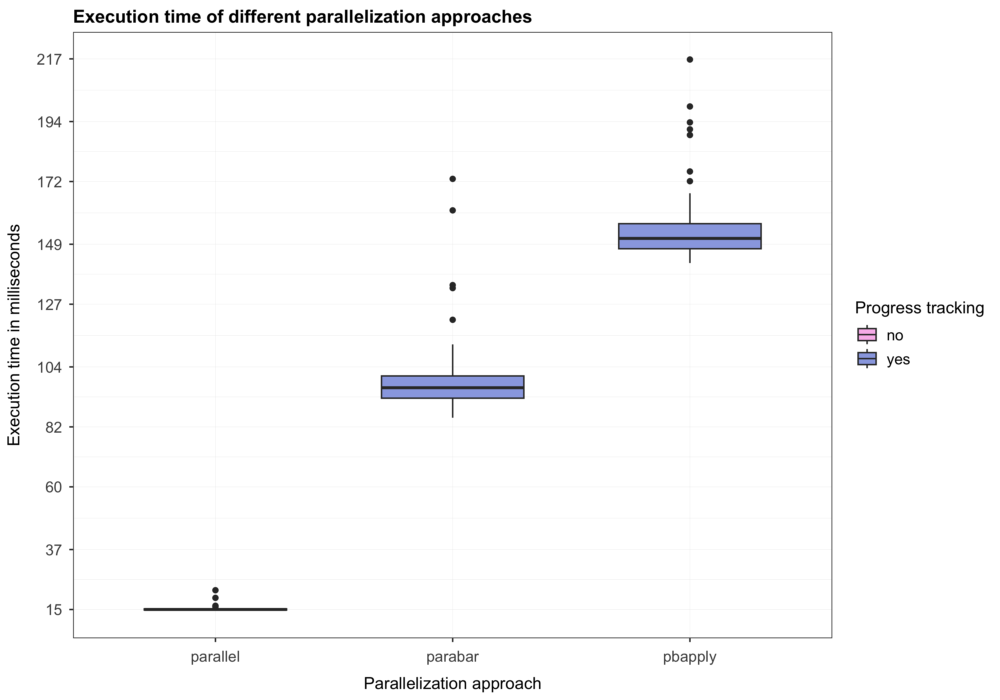

## Introduction

The goal of this article is to compare the
[`parabar`](https://parabar.mihaiconstantin.com) package with other packages
available on `CRAN` that provide **progress tracking** functionality for
parallelized `R` code. While `parabar` provides more features, the comparisons
and benchmarks presented in this article are specifically aimed at its
progress-tracking functionality. The remainder of this article is organized as
follows. I start with a section on how `parabar` tackles progress tracking.
Then, I iterate over other packages that provide progress tracking for parallel
tasks and briefly discuss the approaches these packages employ. Next, I provide
*rough* benchmarks comparing the added overhead of these progress-tracking
approaches to the baseline scenario of using the built-in package
[`parallel`](https://stat.ethz.ch/R-manual/R-devel/library/parallel/html/00Index.html)
(i.e., without progress tracking).

## Progress tracking with `parabar`

The `parabar` package is aimed at two audiences: (1) end-users who intend to use
our package in scripts executed in an interactive `R` session (i.e., see [this
resource](https://parabar.mihaiconstantin.com/#users)), and (2) `R` package
developers (i.e., see [this
resource](https://parabar.mihaiconstantin.com/#developers)). The **two key
concepts** behind `parabar` are
*[backends](https://parabar.mihaiconstantin.com/#backends)* and
*[contexts](https://parabar.mihaiconstantin.com/#contexts)*. Below I describe
these concepts in more detail and demonstrate how they can be used to add new
functionality to `parabar`. This example that follows is focused on progress
tracking, and it represents but one example of what is possible. You may check
out the [UML
diagram](https://raw.githubusercontent.com/mihaiconstantin/parabar/main/inst/design/parabar-design.drawio.svg)
for a more detailed overview of the package design.

### Backends

A [backend](https://parabar.mihaiconstantin.com/reference/Backend.html) is an
[`R6`](https://r6.r-lib.org) class wrapper around a *cluster* object obtained
from the `?parallel::makeCluster` function. The role of a backend is to abide by
a standardized way of interacting with `parallel` clusters by implementing the
`?BackendService` interface. In a nutshell, the `?BackendService` interface
defines the set of operations that a backend can perform on a cluster object
(e.g., exporting variables, evaluating expressions, running parallel tasks
etc.). Backends can be of different types. Currently, `parabar` supports
*synchronous* and *asynchronous* backends. A [synchronous
backend](https://parabar.mihaiconstantin.com/reference/SyncBackend.html) manages
a cluster created in the same process as the backend instance itself. An
[asynchronous
backend](https://parabar.mihaiconstantin.com/reference/AsyncBackend.html), on
the other hand, manages a cluster created in a background `R` session (i.e.,
created via the [`callr`](https://callr.r-lib.org) package). In principle, it is
possible to extend `parabar` with other types of backends (e.g., backends that
are created on a remote server and managed over `SSH`).

### Contexts

The `parabar` package is designed with extensibility in mind, which brings us to
the second key concept, namely, **contexts**. New functionality can be
implemented as *custom contexts* that extend the *base context* class. In simple
terms, a *context* is an `R6` wrapper class for a backend instance, with the
role of determining how the backend operations defined by the `?BackendService`
interface should be executed. The base `?Context` (i.e., that all other custom
contexts extend) implements the same `?BackendService` as the backend instance
and simply forwards its method calls to the backend instance, which in turn
interacts with the cluster. For example, calling the `sapply` method on a base
`?Context` instance will forward the call to the corresponding `sapply` method
on the wrapped `?Backend` instance, which contains the actual implementation
details for interacting with the cluster object (e.g., via
`?parallel::parSapply`).

### Progress tracking functionality

New functionality can be added by creating custom contexts that extends the base
context. Custom contexts can then override and decorate the methods of the base
context to provide the desired functionality. The `?ProgressTrackingContext` is
an example of such a custom context that decorates the `sapply` method to add
progress tracking. This specific context works by overriding the `sapply` method
of the base `?Context` class to add the necessary functionality for progress
tracking. More specifically, if we take a look at the [source code]
(https://github.com/mihaiconstantin/parabar/blob/1164f76e4b8c21a983d15b5c23ecad25bd667eaf/R/Context.R#L201-L217)
for the `sapply` method of the base `?Context` (i.e., at commit
[`1164f76`](https://github.com/mihaiconstantin/parabar/tree/1164f76e4b8c21a983d15b5c23ecad25bd667eaf))
we see the following:

```r
# ...

sapply = function(x, fun, ...) {
    # Consume the backend API.
    private$.backend$sapply(x = x, fun = fun, ...)
}

# ...
```

This method simply passes its arguments to the `sapply` method of the wrapped
backend instance (i.e., stored in the private field `.backend`). Note that the
`?Backend` and the `?Context` classes share a `sapply` method since both
implement the `?BackendService` interface that requires them to provide an
implementation for such a method. The custom `?ProgressTrackingContext` can
*override* the [`sapply`
method](https://github.com/mihaiconstantin/parabar/blob/1164f76e4b8c21a983d15b5c23ecad25bd667eaf/R/ProgressTrackingContext.R#L335-L359)
above to provide progress-tracking capabilities as follows:

```r
# ...

sapply = function(x, fun, ...) {
    # Prepare the backend operation with early evaluated `...`.
    operation <- bquote(
        do.call(
            super$sapply, c(list(x = .(x), fun = fun), .(list(...)))
        )
    )

    # Execute the task using the desired backend operation.
    private$.execute(operation = operation, fun = fun, total = length(x))
}

# ...
```

We can see that the `sapply` operation is prepared as a quoted expression that
is passed to and handled by the private [method
`.execute`](https://github.com/mihaiconstantin/parabar/blob/1164f76e4b8c21a983d15b5c23ecad25bd667eaf/R/ProgressTrackingContext.R#L266-L286).
The `.execute` method is responsible for ensuring that the task function is
decorated to log the progress after each task execution, and that the progress
bar is displayed and updated based on the progress reported in the log file:

```r
# ...

.execute = function(operation, fun, total) {
    # Create file for logging progress.
    log <- private$.make_log()

    # Clear the temporary file on function exit.
    on.exit({
        # Remove.
        unlink(log)
    })

    # Decorate the task function.
    fun <- private$.decorate(task = fun, log = log)

    # Evaluate the operation now referencing the decorated task.
    eval(operation)

    # Show the progress bar and block the main process.
    private$.show_progress(total = total, log = log)
}

# ...
```

Breaking down the implementation above, the following lines of code

```r
# Create file for logging progress.
log <- private$.make_log()

# Clear the temporary file on function exit.
on.exit({
    # Remove.
    unlink(log)
})
```

[create a temporary
file](https://github.com/mihaiconstantin/parabar/blob/1164f76e4b8c21a983d15b5c23ecad25bd667eaf/R/ProgressTrackingContext.R#L133-L149)
where the `task` function will record the progress after each task execution,
and remove this file when the parallel task has completed. The next line of code

```r
# Decorate task function.
task <- private$.decorate(task = fun, log = log)
```

[decorates the
`task`](https://github.com/mihaiconstantin/parabar/blob/1164f76e4b8c21a983d15b5c23ecad25bd667eaf/R/ProgressTrackingContext.R#L151-L196)
function by injecting code that enables it to record the progress in the `log`
file after each execution. Next, we evaluate the `operation` expression that
contains the call to the `sapply` method of the base `?Context` class (i.e., via
the `super` access modifier). Evaluating this operation will implicitly use of
the *decorated* `task` function available in the current environment:

```r
# Evaluate the operation now referencing the decorated task.
eval(operation)
```

As mentioned earlier, this call is simply forwarded to the `sapply` method of
the `.backend` instance. However, unlike before, the `task` function is now
decorated to log the progress to a file. Finally, the following line of code

```r
# Show the progress bar and block the main process.
private$.show_progress(total = length(x), log = log)
```

simply creates a `?Bar` instance to display and update a progress bar based on
the progress reported in the `log` file (i.e., see [source code
here](https://github.com/mihaiconstantin/parabar/blob/1164f76e4b8c21a983d15b5c23ecad25bd667eaf/R/ProgressTrackingContext.R#L198-L264)).

In summary, `parabar` enables progress-tracking for parallel tasks by adjusting
the `task` function to log to a file each time a task has finished executing.
The log file is then monitored periodically and used to update the progress bar
displayed in the console (i.e., see also the `progress_timeout` field of
`?Options` for how to adjust the timeout between subsequent checks of the log
file). The benefits of this approach are two fold. First, the progress bar will
accurately reflect the execution progress of the task. Second, this scales well
to any kind of tasks (i.e., both simple and complex). On the other hand, one
potential disadvantage of this approach is the overhead associated with the I/O
for writing and reading the execution progress.

## Progress tracking with `pbapply`

[`pbapply`](https://peter.solymos.org/pbapply/) is a versatile package that
provides progress tracking for various backends and vectorized `R` functions in
the `*apply` family. To understand how `pbapply` approaches progress tracking,
we can take a look at the implementation details of the `?pbapply::pblapply`
function, which seems to be the workhorse function used by the other `*apply`
variants. At the time of writing this article, the most recent version of the
function `?pbapply::pblapply` is at the commit
[`0195d77`](https://github.com/psolymos/pbapply/commit/0195d7730b856b5249f294541acbe9bc0bbd626a)
on May 23, 2023, in the file
[`pblapply.R`](https://github.com/psolymos/pbapply/blob/0195d7730b856b5249f294541acbe9bc0bbd626a/R/pblapply.R).
Looking at the [source code
lines](https://github.com/psolymos/pbapply/blob/0195d7730b856b5249f294541acbe9bc0bbd626a/R/pblapply.R#L51-L66)
`51` to `66` in the file `pblapply.R` we see the following code:

```r
# ...
if (inherits(cl, "cluster")) {                                  # 51
    ## switch on load balancing if needed                       # 52
    PAR_FUN <- if (isTRUE(getOption("pboptions")$use_lb))       # 53
        parallel::parLapplyLB else parallel::parLapply          # 54
    if (!dopb())                                                # 55
        return(PAR_FUN(cl, X, FUN, ...))                        # 56
    ## define split here and use that for counter               # 57
    Split <- splitpb(length(X), length(cl), nout = nout)        # 58
    B <- length(Split)                                          # 59
    pb <- startpb(0, B)                                         # 60
    on.exit(closepb(pb), add = TRUE)                            # 61
    rval <- vector("list", B)                                   # 62
    for (i in seq_len(B)) {                                     # 63
        rval[i] <- list(PAR_FUN(cl, X[Split[[i]]], FUN, ...))   # 64
        setpb(pb, i)                                            # 65
    }                                                           # 66
# ...
} # ...
```

Line `51` in the code snippet above is used to determine whether the parallel
backend is a `cluster` object created via the `parallel` package. When that is
the case, `pbapply` proceeds in lines `53` and `54` with choosing the
appropriate `?parallel::parLapply` function for the parallelization (i.e., with
or without load balancing). Then, lines `55` and `56` determine whether a
progress bar should be displayed based on the `dopb` function.

The more interesting part, is represented by lines `57` to `66`, which are used
to define how the progress bar will be created and updated. More specifically,
line `58` splits the task repetitions into smaller chunks based on how many
tasks we want to run (i.e., `nx`), how many nodes are in the cluster (i.e.,
`ncl`), and the maximum number of splits we want (i.e., `nout`). For example,
suppose we want want to run $20$ tasks in parallel on a cluster with three
nodes, with the default value of `nout = NULL`. In this case, `pbapply` creates
the following splits:

```r
# Create task splits.
splits <- pbapply::splitpb(nx = 20, ncl = 3, nout = NULL)

# Print the splits.
print(splits)
#> [[1]]
#> [1] 1 2 3
#>
#> [[2]]
#> [1] 4 5 6
#>
#> [[3]]
#> [1] 7 8 9
#>
#> [[4]]
#> [1] 10 11 12
#>
#> [[5]]
#> [1] 13 14 15
#>
#> [[6]]
#> [1] 16 17 18
#>
#> [[7]]
#> [1] 19 20
```

We see that `?pbapply::splitpb` produced seven splits, each consisting of two or
three task repetitions. In lines `59` and `60` `pbapply` counts how many splits
were created and starts a progress bar with a minimum of zero and a maximum
value set to the total number of splits (i.e., seven in this case). Even more
interesting are lines `63` to `66`. Here, `pbapply` loops over each split and
calls the selected parallel function (e.g., `?parallel::parLapply`) with the
task repetitions corresponding to the current split processed. As soon as this
parallel function returns, the progress bar is updated with the processed split
index. Therefore, in the example above, `pbapply` will call the parallel
function seven times, and hence update the progress bar seven times.

The code snippet above already provides us with two important insights into how
`pbapply` works. First, by default, `pbapply` does not update the progress bar
after each task repetition. Second, the overhead `pbapply` adds is likely given
by the repeated calls to the parallel function (e.g., `?parallel::parLapply`)
that involves transferring the tasks to the different processes that make up the
cluster nodes.

We can compare this with the source code of the built-in function
`?parallel::parLapply` displayed below, where we let `X` represent our $20$ task
repetitions and `fun` the task function to be applied to each repetition:

```r
function(cl = NULL, X, fun, ..., chunk.size = NULL) {   # 1
    cl <- defaultCluster(cl)                            # 2
    nchunks <- parallel:::staticNChunks(                # 3
        length(X),                                      # 4
        length(cl),                                     # 5
        chunk.size                                      # 6
    )                                                   # 7
    do.call(                                            # 8
        c,                                              # 9
        clusterApply(                                   # 10
            cl = cl,                                    # 11
            x = parallel:::splitList(X, nchunks),       # 12
            fun = lapply,                               # 13
            FUN = fun,                                  # 14
            ...                                         # 15
        ),                                              # 16
        quote = TRUE                                    # 17
    )                                                   # 18
}                                                       # 19
```

We can see on lines `3` and `12` calls to two internal functions of the
`parallel` package, namely, `parallel:::staticNChunks` and
`parallel:::splitList`. Applying these functions to our example results in the
following splits:

```r
# Task repetitions.
X <- 1:20

# Number of nodes in the cluster.
ncl <- 3

# Compute chunk size based on that repetitions and cluster size.
nchunks <- parallel:::staticNChunks(length(X), ncl, NULL)

# Print the chunk size.
print(nchunks)
#> [1] 3

# Create the task splits.
parallel:::splitList(X, nchunks)
#> [[1]]
#> [1] 1 2 3 4 5 6 7
#>
#> [[2]]
#> [1]  8  9 10 11 12 13
#>
#> [[3]]
#> [1] 14 15 16 17 18 19 20
```

We see that `pbapply` uses a similar approach for creating the task splits,
however, unlike `pbapply`, the built-in `parallel` package creates by default as
many tasks splits as nodes in the cluster. This means that the
`?parallel::clusterApply` function used within `?parallel::parLapply` will only
be called three times, i.e., as stated in the
[documentation](https://stat.ethz.ch/R-manual/R-devel/library/parallel/html/clusterApply.html):

> `clusterApply` calls fun on the first node with arguments x[[1]] and ..., on
> the second node with x[[2]] and ..., and so on, recycling nodes as needed.

This approach is strikingly different from `pbapply` which, for this example,
results in calling the parallel function (e.g., `?parallel::parLapply`) seven
times, which, in turn, results in calling the `?parallel::clusterApply` for each
individual task repetition. Put simply, for the example above, the `parallel`
package calls the `?parallel::clusterApply` for each chunk, whereas `pbapply`
calls the `?parallel::clusterApply` for each task repetition. Therefore, the
`pbapply` progress tracking functionality can be regarded as a tradeoff between
the granularity of the progress bar and the overhead associated with chunking
the task repetitions and communicating with the cluster nodes. While this
overhead is likely negligible when the number of tasks is low, such repeated
calls to the `?parallel::clusterApply` are definitely something one should
consider when scaling things up.

In the next section, I provide rough estimates of the overhead associated with
the progress-tracking approaches discussed above.

## Overhead

To make things as comparable as possible, I start by defining a dummy task
function that we can reliably measure how long it takes to execute. We then run
$1000$ repetitions of this task in parallel via the built-in function
`?parallel::parSapply` to establish the baseline execution time. This baseline
execution time serves as our benchmark for comparing the execution times of the
progress-tracking approaches discussed above (e.g., `pbapply` and `parabar`). To
obtain more stable results, we determine the execution times based on $100$
replications of the parallelized task replications, and provide a summary in the
form of a figure. To achieve this, we use the
[`microbenchmark`](https://CRAN.R-project.org/package=microbenchmark) package
for benchmarking the execution times, and the
[`ggplot2`](https://ggplot2.tidyverse.org) package for plotting the results.

### The task function

We start by loading the libraries needed for the benchmarks below.

```r
# Load libraries.
library(parallel)
library(parabar)
library(pbapply)
library(microbenchmark)
library(ggplot2)
```

For our task, we can use the `?base::Sys.sleep` function to simulate a task that
takes a certain amount of time to execute. For the purposes of this article, we
will use a task that takes roughly $0.05$ milliseconds to execute and simply
adds one to the input argument.

```r
# Define task function.
task <- function(x) {
    # Pretend to perform an expensive computation.
    Sys.sleep(0.00005)

    # Return the computation.
    return(x + 1)
}
```

### Baseline execution time

Suppose that we want $1000$ repetitions of the `task` function to be executed in
parallel on a cluster consisting of *five* nodes. We determine the execution
time based on the `?parallel::parSapply` function, which will serve as our
benchmark. We can establish this benchmark using the following code:

```r
# Define the task repetitions.
n_tasks <- 1:1000

# Define the benchmark repetitions.
n_benchmarks <- 100

# Create a cluster of five nodes.
cluster <- makeCluster(spec = 5, type = "PSOCK")

# Measure the execution time of the task function.
duration_parallel <- microbenchmark(
    # The task to benchmark.
    parallel = parSapply(cluster, X = n_tasks, FUN = task),

    # Benchmark repetitions.
    times = n_benchmarks
)

# Stop the cluster.
stopCluster(cluster)

# Print the duration.
print(duration_parallel, unit = "ms")
#> Unit: milliseconds
#>      expr      min       lq     mean   median       uq      max neval
#>  parallel 14.57251 14.81818 15.17978 15.01752 15.23622 22.07887   100
```

Running our `task` in parallel via the `?parallel::parSapply` function takes on
average $M = 15.18$ milliseconds, with a standard deviation of $SD = 0.88$.

### `parabar` execution time

We repeat the same setup as above, but this time using the `parabar` package.
Since the end-user API prevents us from displaying progress bars in
non-interactive sessions (e.g., knitting `R` vignettes), we can, more
conveniently, use the `R6` developer API to force progress-tracking,
nevertheless. In this case, we use the `?parabar::ProgressTrackingContext` that
adds progress tracking functionality to tasks executed in parallel. To avoid
issues with the progress bar not displaying correctly in a non-interactive `R`
session, we will temporarily redirect the progress bar output to `/dev/null`
(i.e., or `nul` on `Windows`) using the `?base::sink` function. Note that the
progress tracking functionality is still employed (i.e., logging the execution
progress to a file and reading the file to update the progress bar), only the
progress bar is not displayed.

```r
# Create a specification object.
specification <- Specification$new()

# Set the number of cores.
specification$set_cores(cores = 5)

# Set the cluster type.
specification$set_type(type = "psock")

# Get a backend instance that does support progress tracking.
backend <- AsyncBackend$new()

# Create a progress-tracking context object.
context <- ProgressTrackingContext$new()

# Register the backend with the context.
context$set_backend(backend)

# Start the backend.
context$start(specification)

# Get a modern bar instance.
bar <- BasicBar$new()

# Register the bar with the context.
context$set_bar(bar)

# Measure the execution time of the task function.
duration_parabar <- microbenchmark(
    # The task to benchmark.
    parabar = {
        # Redirect the output (i.e., use `nul` for `Windows`).
        sink("/dev/null")

        # Run a task in parallel.
        context$sapply(x = n_tasks, fun = task)

        # Get the task output.
        backend$get_output(wait = TRUE)

        # Disable the output redirection.
        sink()
    },

    # Benchmark repetitions.
    times = n_benchmarks
)

# Close the backend.
context$stop()

# Print the duration.
print(duration_parabar, unit = "ms")
#> Unit: milliseconds
#>     expr     min       lq     mean   median       uq      max neval
#>  parabar 85.3611 92.52532 99.01425 96.36281 100.6855 172.9809   100
```

Based on the results above, we observe that running our `task` function in
parallel via `parabar`, with progress tracking, yields an execution time of $M =
99.01$ milliseconds, with a $SD = 12.85$. Therefore, the overhead of `parabar`
relative to `parallel` is roughly $83.83$ milliseconds.

### `pbapply` execution time

We repeat, again, the setup above, but this time using the `pbapply` package via
the `?pbapply::pbsapply` function. Just like `parabar`, `pbapply` disables
progress tracking for non-interactive `R` sessions. Therefore, we first need to
force progress tracking, and, then, to avoid printing issues, redirect the
progress bar output to `/dev/null` (i.e., or `nul` on `Windows`).

<details><summary>Adjust <code>pbapply</code> options</summary>

```r
# Get original `pbapply` options.
pbapply_options <- getOption("pboptions")

# Get `knitr` progress option.
knitr_option <- getOption("knitr.in.progress")

# Create a copy of the `pbapply` options.
pbapply_options_copy <- pbapply_options

# Create a copy of the `knitr` progress option.
knitr_option_copy <- knitr_option

# Adjust the `pbapply` options to set a progress bar type.
pbapply_options_copy$type <- "timer"

# Adjust the `knitr` option to indicate no knitting.
knitr_option_copy <- NULL

# Set the adjusted options.
options(pboptions = pbapply_options_copy)
options(knitr.in.progress = knitr_option_copy)

# Check whether `pbapply` will use a progress bar.
dopb()
#> [1] TRUE
```

</details>

```r
# Create a cluster of five nodes.
cluster <- makeCluster(spec = 5, type = "PSOCK")

# Measure the execution time of the task function.
duration_pbapply <- microbenchmark(
    # The task to benchmark.
    pbapply = {
        # Redirect the output (i.e., use `nul` for `Windows`).
        sink("/dev/null")

        # Run the task in parallel.
        pbsapply(X = n_tasks, FUN = task, cl = cluster)

        # Disable the output redirection.
        sink()
    },

    # Benchmark repetitions.
    times = n_benchmarks
)

# Stop the cluster.
stopCluster(cluster)

# Print the duration.
print(duration_pbapply, unit = "ms")
#> Unit: milliseconds
#>     expr      min       lq     mean   median       uq      max neval
#>  pbapply 142.1083 147.3204 154.3072 151.1385 156.6055 216.7699   100
```

<details><summary>Restore <code>pbapply</code> options</summary>

```r
# Restore the original `pbapply` options.
options(pboptions = pbapply_options)

# Restore the original `knitr` option.
options(knitr.in.progress = knitr_option)
```

</details>

The results above indicate that running the `task` function in parallel via
`pbapply`, with progress tracking, has an average execution time of $M = 154.31$
milliseconds, with a $SD = 12.4$. Based on these results, the overhead of
`pbapply` relative to `parallel` is roughly $139.13$ milliseconds.

### Summary

In this section, I provide a brief summary of the differences in the execution
times between the parallelization approaches discussed above. First, we can test
whether there are significant differences in the average execution time of
`parabar` and `pbapply`.

```r
# Extract duration in milliseconds for `parabar`.
parabar_time_ms <- duration_parabar$time / 1e6

# Extract duration in milliseconds for `pbapply`.
pbapply_time_ms <- duration_pbapply$time / 1e6

# Test for mean differences.
test_result <- t.test(
    x = parabar_time_ms,
    y = pbapply_time_ms,
)

# Print the test result.
print(test_result)
#>
#> 	Welch Two Sample t-test
#>
#> data:  parabar_time_ms and pbapply_time_ms
#> t = -30.96, df = 197.75, p-value < 2.2e-16
#> alternative hypothesis: true difference in means is not equal to 0
#> 95 percent confidence interval:
#>  -58.81492 -51.77103
#> sample estimates:
#> mean of x mean of y
#>  99.01425 154.30722
```

The test statistic indicates that there are statistically significant mean
differences between the execution times of the `parabar` (i.e., $M = 99.01$, $SD
= 12.85$) and `pbapply` (i.e., $M = 154.31$, $SD = 12.4$) packages, with
$t(197.75) = -30.96$, $p < 0.001$.

Now, we can proceed to display the execution time of the different
parallelization approaches we discussed. We start with a pre-processing step
that combines all results into a data frame and computes additional variables
(e.g., the execution time in milliseconds).

```r
# Create data frame from duration objects.
results <- rbind(
    duration_parallel,
    duration_parabar,
    duration_pbapply
)

# Create execution time column in milliseconds.
results$time_ms <- results$time / 1e6

# Create column indicating progress tracking.
results$progress <- factor(
    ifelse(with(results, expr %in% c("parabar", "pbapply")), "yes", "no")
)

# Print the data frame.
print(results)
#> Unit: milliseconds
#>      expr       min        lq      mean    median        uq       max neval
#>  parallel  14.57251  14.81818  15.17978  15.01752  15.23622  22.07887   100
#>   parabar  85.36110  92.52532  99.01425  96.36281 100.68546 172.98093   100
#>   pbapply 142.10834 147.32038 154.30722 151.13853 156.60555 216.76987   100
```

Finally, we can plot the box plots of the execution times corresponding to the
different parallelization approaches we discussed.

<details><summary>Code for plotting the results</summary>

```r
# Plot the results.
ggplot(data = results, aes(x = expr, y = time_ms)) +
    geom_boxplot(
        aes(fill = progress),
        width = 0.6
    ) +
    scale_y_continuous(
        breaks = round(seq(min(results$time_ms), max(results$time_ms), length.out = 10)),
    ) +
    labs(
        title = "Execution time of different parallelization approaches",
        x = "Parallelization approach",
        y = "Execution time in milliseconds"
    ) +
    scale_fill_manual(
        name = "Progress tracking",
        values = c("#f9bcec", "#9aa9e3")
    ) +
    theme_bw() +
    theme(
        plot.title = element_text(
            face = "bold",
            vjust = 0.5,
            size = 13
        ),
        axis.title.x = element_text(
            margin = margin(t = 10, r = 0, b = 0, l = 0),
            size = 12
        ),
        axis.title.y = element_text(
            margin = margin(t = 0, r = 10, b = 0, l = 0),
            size = 12
        ),
        axis.text.x = element_text(
            margin = margin(t = 5, r = 0, b = 0, l = 0),
            size = 11,
            vjust = 0.5,
        ),
        axis.text.y = element_text(
            margin = margin(t = 0, r = 5, b = 0, l = 0),
            size = 11
        ),
        legend.title = element_text(
            size = 12
        ),
        legend.text = element_text(
            size = 11
        ),
        panel.grid.minor = element_line(
            linewidth = 0.1
        ),
        panel.grid.major = element_line(
            linewidth = 0.1
        )
    )
```

</details>



## Conclusion

In this article, I discussed different approaches for adding progress-tracking
functionality to parallelized `R` code, and showed that the `parabar` package is
a good alternative to `pbapply` for achieving this. The `parabar` package
demonstrated better performance over the `pbapply` in terms of execution time
(i.e., when the number of tasks to run is large enough relative to the number of
nodes in the cluster). Execution time aside, `parabar` also provides more
granular progress bars that reflect the actual progress of the task, rather than
the progress of the parallelization process. Despite the name, `parabar` is more
than just a package that adds progress bars for parallelized `R` code. Through
its design, it provides a standardized way of interacting with the built-in
`parallel` package. On top of that, it proposes an extensible mechanism to
augment the `parallel` package functions with new functionality. This is a key
benefit that allows one to customize the parallelization process in many
different ways, such as sending an email when the parallelized task is finished
executing. Therefore, the progress tracking functionality discussed in this
article is just one example of what is possible with `parabar`.
